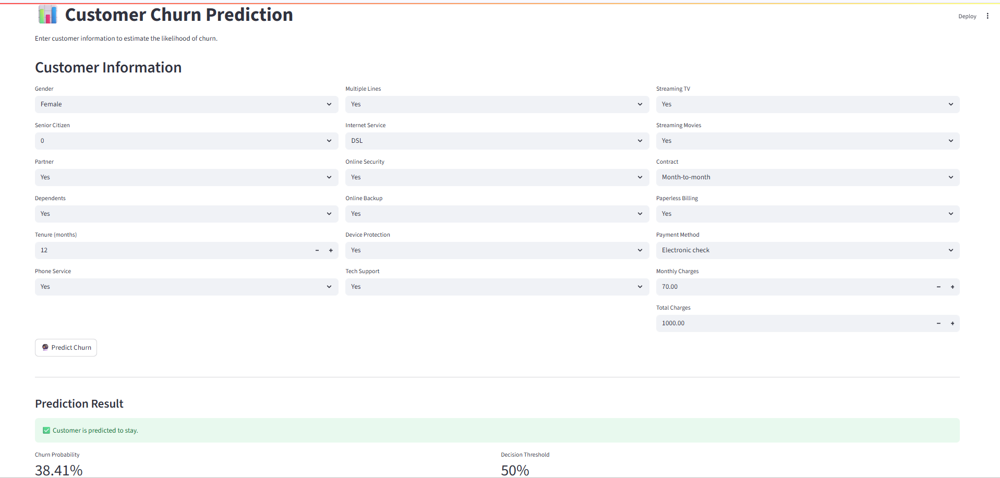
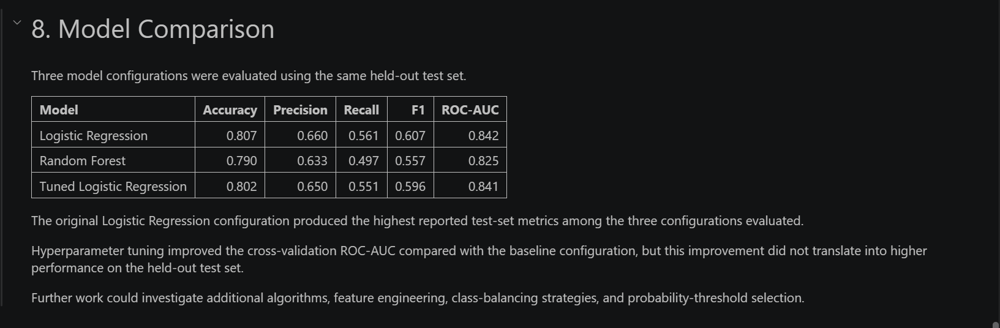
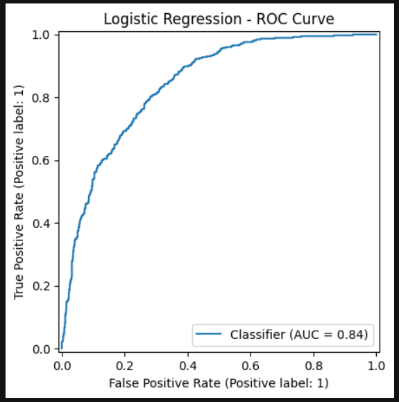

# 📊 Customer Churn Prediction

An end-to-end Machine Learning project that predicts customer churn
using customer demographics, services, contract information, and
billing data.

The project covers the complete Data Science workflow:

- Data cleaning
- Exploratory Data Analysis (EDA)
- Feature engineering
- Data preprocessing
- Machine Learning
- Model evaluation
- Hyperparameter tuning
- Threshold analysis
- Model interpretation
- Streamlit deployment

---

## 🎯 Project Objective

Customer churn is an important business problem for subscription-based
companies.

The objective of this project is to develop a Machine Learning model
that estimates the probability that a customer will churn.

The project also investigates which customer characteristics are
associated with the model's churn predictions.

---

## 📂 Dataset

The project uses a Telco Customer Churn dataset containing customer
demographic, service, contract, and billing information.

### Dataset dimensions

- 7,043 customers
- 21 columns

### Target variable

`Churn`

- `No` → Customer stayed
- `Yes` → Customer churned

### Class distribution

- No Churn: 73.46%
- Churn: 26.54%

---

## 🔎 Exploratory Data Analysis

The analysis investigated:

- Missing values
- Duplicate records
- Data types
- Target distribution
- Customer tenure
- Monthly charges
- Total charges
- Contract type
- Internet service
- Payment method
- Partner and dependent status
- Customer support services

### Important observations

Customers with month-to-month contracts showed a substantially
different churn pattern compared with customers on longer contracts.

Fiber optic customers also showed a higher observed churn rate than
DSL and customers without internet service.

Customers with shorter tenure showed higher observed churn levels in
the exploratory analysis.

These observations describe patterns in the dataset and should not be
interpreted as causal relationships.

---

## 🧹 Data Cleaning

The dataset was checked for:

- Missing values
- Duplicate records
- Incorrect data types
- Blank values in `TotalCharges`

There were:

- 0 duplicate rows
- 0 missing values after loading
- 11 blank `TotalCharges` values

The blank `TotalCharges` records were identified and handled during
data preparation.

---

## ⚙️ Data Preprocessing

The Machine Learning pipeline uses:

### Numerical features

- SeniorCitizen
- tenure
- MonthlyCharges
- TotalCharges

Numerical features were standardized using:

`StandardScaler`

### Categorical features

Categorical variables were transformed using:

`OneHotEncoder`

The preprocessing and model were combined into a Scikit-learn
Pipeline to ensure consistent transformations during training and
prediction.

---

## 🤖 Machine Learning Models

Three model configurations were evaluated:

1. Logistic Regression
2. Random Forest
3. Tuned Logistic Regression

### Model comparison

| Model | Accuracy | Precision | Recall | F1 | ROC-AUC |
|---|---:|---:|---:|---:|---:|
| Logistic Regression | 80.7% | 66.0% | 56.1% | 60.7% | 84.2% |
| Random Forest | 79.0% | 63.3% | 49.7% | 55.7% | 82.5% |
| Tuned Logistic Regression | 80.2% | 65.0% | 55.1% | 59.6% | 84.1% |

The original Logistic Regression configuration produced the highest
reported test-set metrics among the evaluated configurations.

---

## 📈 Threshold Analysis

The default classification threshold was 0.50.

Alternative thresholds were tested to understand the
precision-recall trade-off.

| Threshold | Precision | Recall | F1 |
|---:|---:|---:|---:|
| 0.30 | 51.9% | 75.4% | 61.5% |
| 0.35 | 54.4% | 70.9% | 61.6% |
| 0.40 | 57.1% | 66.8% | 61.6% |
| 0.45 | 60.1% | 61.5% | 60.8% |
| 0.50 | 66.0% | 56.1% | 60.7% |
| 0.55 | 67.7% | 46.0% | 54.8% |
| 0.60 | 71.8% | 40.1% | 51.5% |

Lowering the threshold increased recall while reducing precision.

The appropriate threshold depends on the relative business costs of
false positives and false negatives.

---

## 🔍 Model Interpretation

Logistic Regression coefficients were analyzed to understand which
features contributed most strongly to the model's predictions.

Some of the strongest coefficients included:

- Contract type
- Tenure
- Fiber optic internet service
- Total charges
- Payment method
- Streaming services
- Online security
- Technical support

Positive coefficients indicate an association with higher predicted
churn probability, while negative coefficients indicate an association
with lower predicted churn probability.

These coefficients represent model associations and should not be
interpreted as causal effects.

---

## 📊 Confusion Matrix

The baseline Logistic Regression model produced:

- True Negatives: 927
- False Positives: 108
- False Negatives: 164
- True Positives: 210

The false-negative count highlights why recall is an important metric
for this churn prediction problem.

---

## 🌐 Streamlit Application

The project includes an interactive Streamlit application.

Users can enter customer information including:

- Demographics
- Tenure
- Internet service
- Contract type
- Payment method
- Monthly charges
- Total charges
- Support services

The application returns:

- Churn prediction
- Churn probability

## 📸 Project Screenshots

### Streamlit Prediction App

The Streamlit application allows users to enter customer information and receive a churn prediction with the estimated churn probability.



### Model Comparison

The project evaluates Logistic Regression, Random Forest, and Tuned Logistic Regression using multiple classification metrics.



### ROC Curve

The Logistic Regression model achieved a ROC-AUC of approximately 0.84 on the held-out test set.


---

## 📁 Project Structure

```text
customer-churn-prediction/
│
├── data/
│   └── Telco-Customer-Churn.csv
│
├── models/
│   └── churn_logistic_model.pkl
│
├── notebooks/
│   └── 01_EDA_and_Model.ipynb
│
├── src/
│
├── app.py
├── README.md
├── requirements.txt
└── .gitignore